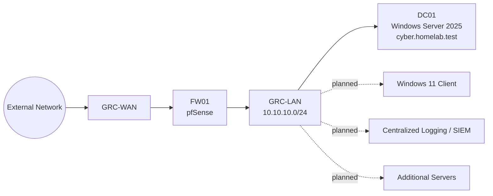

# Northstar GRC Homelab

A portfolio-focused virtual homelab for practicing Governance, Risk, and Compliance (GRC), technology risk analysis, control assessment, audit evidence collection, and security documentation.

> **Fictional organization:** Northstar Technical Solutions  
> **Lab platform:** Hyper-V  
> **Primary domain:** `cyber.homelab.test`  
> **Primary network:** `10.10.10.0/24`

## Project Goals

- Build a realistic small-enterprise virtual environment.
- Translate technical configurations into business risk and control language.
- Practice risk assessments, control testing, evidence collection, and audit workpapers.
- Map technical controls to NIST CSF 2.0 and ISO/IEC 27001:2022 concepts.
- Produce portfolio artifacts that demonstrate GRC and technology-risk skills without exposing credentials or unsafe configuration data.

## Current Lab State

| Component | Current State | Notes |
|---|---|---|
| Hyper-V host | Complete | Virtual lab runs on a single home system. |
| `FW01` | Complete / active lab component | pfSense firewall VM. |
| `GRC-WAN` | Complete | WAN-side Hyper-V virtual network. |
| `GRC-LAN` | Complete | Internal lab network. |
| LAN subnet | Complete | `10.10.10.0/24`. |
| `DC01` | Current lab component | Windows Server 2025 server for directory and infrastructure services. |
| Domain | Selected for current project | `cyber.homelab.test`. |
| AD DS / DNS validation | In progress | Validate final implementation and capture evidence. |
| DHCP on `DC01` | Planned | Windows DHCP is intended to serve the lab LAN. |
| VLAN segmentation | Planned | No VLANs are represented as operational yet. |
| Centralized logging / SIEM | Planned | Future phase. |
| Additional servers | Planned | File, web, and security systems will be added later. |
| Automated backups | Planned | Backup control is documented but not yet represented as operational. |

## Architecture



## Repository Structure

```text
northstar-grc-homelab/
├── README.md
├── PROJECT_STATUS.md
├── ROADMAP.md
├── SECURITY.md
├── docs/
│   ├── architecture/
│   │   ├── network-topology.md
│   │   └── naming-and-addressing.md
│   └── build-log/
│       ├── step-01-hyper-v.md
│       ├── step-02-pfsense.md
│       └── step-03-windows-server.md
├── governance/
│   ├── asset-register.csv
│   ├── control-matrix.csv
│   ├── evidence-register.csv
│   ├── risk-register.csv
│   ├── policies/
│   │   └── Northstar-Technical-Solutions-Company-Policies.md
│   └── templates/
│       ├── audit-workpaper-template.md
│       ├── control-assessment-template.md
│       └── risk-assessment-template.md
└── evidence/
    ├── screenshots/
    └── config-sanitized/
```

## Framework Baseline

This project uses the following references as its working governance baseline:

- NIST Cybersecurity Framework (CSF) 2.0
- ISO/IEC 27001:2022 and Amendment 1:2024
- ISO/IEC 27002:2022
- NIST SP 800-53 Rev. 5
- NIST SP 800-30 Rev. 1
- NIST SP 800-61 Rev. 3
- NIST SP 800-63B-4

The repository is a learning environment, not a claim of certification or formal compliance.

## Evidence Philosophy

Every control should be traceable through this chain:

**Requirement → Control → Implementation → Evidence → Assessment Result → Risk / Remediation**

Technical evidence should be sanitized before being committed. Credentials, private keys, raw firewall backups, tokens, VM disks, and other sensitive material must never be stored in this repository.
