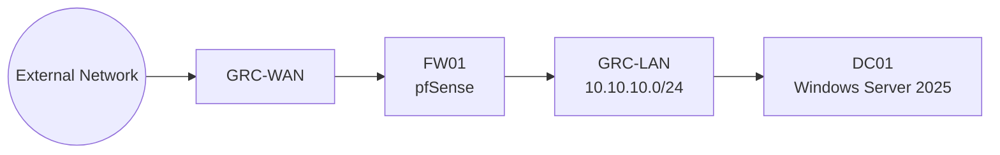
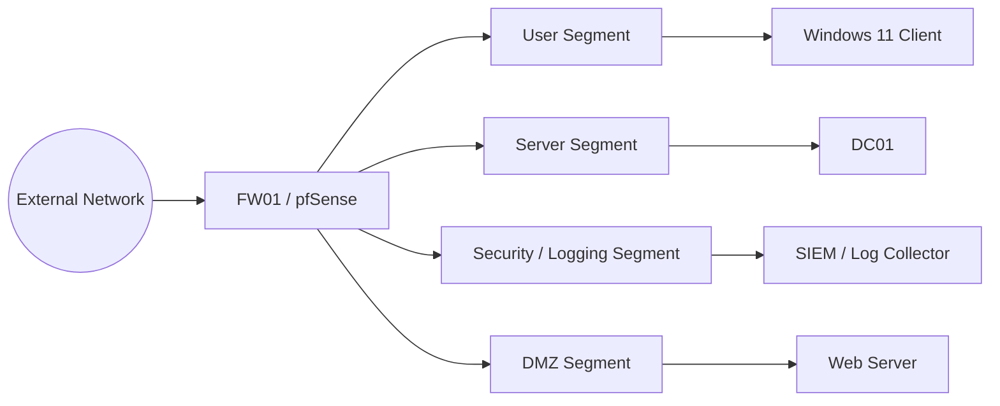

# Network Topology

## Current Topology

## Current Design Notes

- `FW01` provides the firewall boundary between `GRC-WAN` and `GRC-LAN`.
- `GRC-LAN` uses `10.10.10.0/24`.
- `DC01` is the Windows Server 2025 infrastructure server for the lab.
- The current project domain is `cyber.homelab.test`.
- DHCP is intended to run on `DC01`; it is not represented as verified operational in this repository yet.
- VLAN segmentation is a future-state control and is not represented as currently implemented.

## Future-State Topology

The future-state diagram is intentionally labeled as planned. It should not be used as evidence of implemented segmentation.
